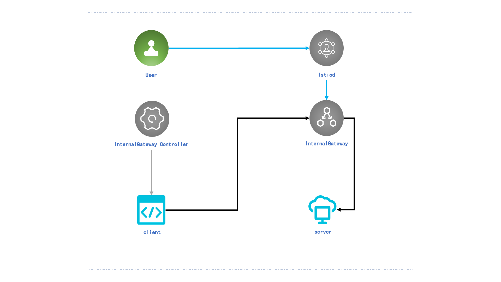

# Table of Contents

- [Introduction](#introduction)
- [Build](#build)
- [Prerequisite](#prerequisite)
- [Install](#install)
- [Usage](#usage)
- [License](#license)

# Introduction
The east-west traffic in Istio is carried by envoy sidecars, which are deployed in every pod together with the application containers. Sidecars provide the functions of secure service-to-service communication, load balancing for various protocols, flexible traffic control and policy, and complete tracing.

However, there are also a few disadvantages of sidecars. First of all, deploying one sidecar to every pod can be resource-consuming and introduce complexity, especially when the number of pods is huge. Not only must those resources be provisioned to the sidecars, but also the control plane to manage the sidecar and to push configurations can be demanding. Second, a query needs to go through two sidecars, one in the source pod and the other one in the destination pod,  in order to reach the destination. For delay-sensitive applications, sometimes, the extra time spent in the sidecars is not acceptable.

We noted that, for the majority of our HTTP applications, many of the rich features in sidecars are unused. That's why we want to propose a light-weighted way to serve east-west traffic without the drawbacks mentioned in the previous paragraph. Our focus is on the HTTP applications that do not require advanced security features, like mTLS.

We propose the centralized east-west traffic gateway, which moves the sidecars and the functionalities they carry to nodes that are dedicated for sidecars, and no application container shares those nodes. This way, no modifications are required on the nodes, and we can save on the resources and the delay. In addition, we can decouple the network management from application management,  and also avoid the resource competition between application and networking. However, because we move the sidecars out of the nodes of applications, we at the same time lose some of the security and tracing abilities provided by the original sidecars. Our observation is that the majority of our applications do not require those features.

# Build
1. Dependency management(Optional)
```
go mod vendor
```
2. Build
```
go build -o bin/canal-controller cmd/main.go
```
3. Build cross-platform images(Optional)
```
CGO_ENABLED=0 GOOS=linux GOARCH=amd64 go build -o bin/canal-controller cmd/main.go
```
4. Get a base image
```
docker pull docker.io/library/alpine:3.11.6
```
5. Build the image with the following Dockerfile
```
FROM alpine:3.11.6
COPY bin/canal-controller /canal-controller
CMD /canal-controller --logtostderr=true
```
6. Build the docker image
```
docker build -f /path/to/your/Dockerfile . -t ${region}/${namespce}/canal:${tag}
```
7. Push the image to the remote repository
```
docker push ${region}/${namespce}/canal:${tag}
```

# Prerequisite
1. Only one Gateway can be attached to InternalGateway.
2. The VirtualService managed by InternalGateway must be attached to the Gateway mention in 1.
3. CoreDNS is required.


# Install

1. Install the Istio base chart which contains cluster-wide resources used by the Istio control plane
```
helm install istio-base ./base -n istio-system
```
2. Install the Istio discovery chart which deploys the istiod service
```
helm install istiod ./istio-discovery/ -n istio-system
```
3. Install the Canal Gateway(router mode Envoy)
```
helm install canal-gateway ./canal -n istio-system
```
4. Install the Canal Controller
```
helm install canal-control ./canal-control -n istio-system \
    --set global.hub=${your hub} \
    --set global.imagePullSecrets[0]=${your secret} \
    --set global.tag=${your tag}
```

# Usage
## Use centralized east-west traffic gateway to handle east-west traffic
1. Deploy Canal Service.

2. Create HelloWorld service. Note that the port opened must be consistent with the port opened on the gateway.
```
apiVersion: v1
kind: Service
metadata:
  name: helloworld
  labels:
    app: helloworld
spec:
  ports:
  - port: 5000
    name: http
  selector:
    app: helloworld
---
```
3. Create Gateway, and attach it to Canal Gateway.
```
kind: Gateway
metadata:
  name: canal
  namespace: istio-system
spec:
  selector:
    app: canal-gateway
  servers:
  - port:
      number: 5000
      name: http
      protocol: HTTP
    hosts:
    - "*"
---
```
4. Create VirtualService.
```
apiVersion: networking.istio.io/v1alpha3
kind: VirtualService
metadata:
  name: helloworld
  namespace: istio-system
spec:
  hosts:
  - "*"
  gateways:
  - canal
  http:
  - match:
    - uri:
        exact: /hello
    route:
    - destination:
        host: helloworld.default.svc.cluster.local
---
```
5. Execute the following command. You should find the IP address of the HelloWorld service changed to the gateway's IP.
```
dig helloworld.default.svc.cluster.local
```

## Move existing traffic to centralized east-west traffic gateway

### Approach 1: move only the traffic, and keep the service

1. Deploy Canal Service.

2. Create Gateway, and attach it to Canal Gateway.
```
kind: Gateway
metadata:
  name: canal
  namespace: istio-system
spec:
  selector:
    app: canal-gateway
  servers:
  - port:
      number: 5000
      name: http
      protocol: HTTP
    hosts:
    - "*"
---
```
3. Create VirtualService.
```
apiVersion: networking.istio.io/v1alpha3
kind: VirtualService
metadata:
  name: helloworld
  namespace: istio-system
spec:
  hosts:
  - "*"
  gateways:
  - canal
  http:
  - match:
    - uri:
        exact: /hello
    route:
    - destination:
        host: helloworld.default.svc.cluster.local
---
```
4. Un-inject sidecars by removing the injection command.
```
kubectl label namespace your-namespace istio-injection=disabled
```

### Approach 2: replace the existing service
Note that we can also create a new replacement service, and attach the new service with InternalGateway, and remove the old service.

1. Create a new service and attach it to the internal gateway as instructed before.
```
kind: Gateway
metadata:
  name: canal
  namespace: istio-system
spec:
  selector:
    app: canal-gateway
  servers:
  - port:
      number: 5000
      name: http
      protocol: HTTP
    hosts:
    - "*"
---
```
```
apiVersion: v1
kind: Service
metadata:
  name: helloworld-on-canal
  labels:
    app: helloworld-on-canal
spec:
  ports:
  - port: 5000
    name: http
  selector:
    app: helloworld-on-canal
---
```
```
apiVersion: networking.istio.io/v1alpha3
kind: VirtualService
metadata:
  name: helloworld-on-canal
  namespace: istio-system
spec:
  hosts:
  - "*"
  gateways:
  - canal
  http:
  - match:
    - uri:
        exact: /hello
    route:
    - destination:
        host: helloworld-on-canal.default.svc.cluster.local
```
2. remove the old service.

# License
[Apache License 2.0](./LICENSE)

# Welcome to communicate with us

